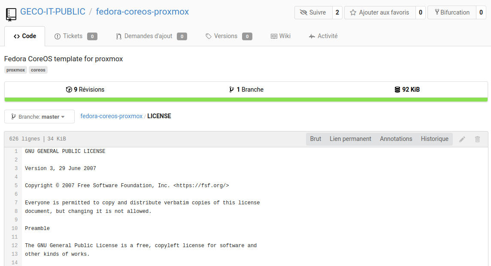

# proxmox-flatcar
A proxmox tool to create Flatcar VM template on Proxmox 6.x.

# Requirements

Tested on Proxmox VE 6.2-4
# Usage

1. Clone this repository on your Proxmox server
2. Configure template parameter by modifying `template_deploy.conf` file as following:

```bash
# template vm vars
TEMPLATE_NAME="TMPL-flatcar" #Template VM name append with <flactar_version> in Proxmox GUI
TEMPLATE_RECREATE="false" #Fore recreate template ?
#Note: If you want only update hook script and Template_Ignition file, you can keep it as false, these files are always overwritten
TEMPLATE_POOL="domain.lan"# domain name written in cloudinit config
TEMPLATE_VMSTORAGE="local" #target storage for Template VM
SNIPPET_STORAGE="local" #target storage for Snippets files
VMDISK_OPTIONS=",discard=on"

TEMPLATE_IGNITION="fcar-base-tmplt.yaml" #Name of template ignition file

# flatcar image version
VERSION=latest # default: latest, possible values: <version_num>, latest, current
PLATFORM=qemu
BASEURL=https://stable.release.flatcar-linux.net
```
3. Got to proxmox-flatcar directory
4. run `./template_deploy.sh`
5. Clone the template on same host.
6. BEFORE first boot: update CloudInit config in Proxmox GUI (no update after first boot)
7. Wait for multiple reboot the enjoy

**Note**: Docker TCP socket is exposed by default

# Known issues

- Cloned VM from template don't update it's ignition file when modifying CloudInit config in Proxmox VE GUI
- If not shared storage is used to deploy template VM you can only deploy VM on same host as template VM (can't migrate)
- Only IPv4 is supported
# Credits
Forked from awesome [Geco-It fedora-coreos-proxmox](https://git.geco-it.net/GECO-IT-PUBLIC/fedora-coreos-proxmox) ([Rev baff530f20](https://git.geco-it.net/GECO-IT-PUBLIC/fedora-coreos-proxmox/commit/baff530f200a708de8b61cb41ca4ba756b8e422d))

Source [GPL V3](https://git.geco-it.net/GECO-IT-PUBLIC/fedora-coreos-proxmox/src/commit/baff530f200a708de8b61cb41ca4ba756b8e422d/LICENSE):

